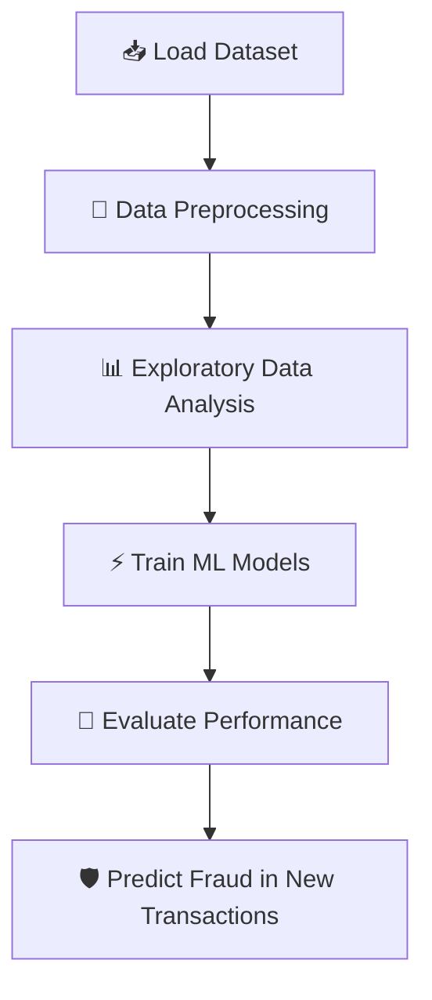

# Fraud Detection with Machine Learning

## 📌 Project Overview

This project, developed by **Nowa Analytics**, demonstrates the application of **predictive models** in fraud detection.

Fraud is a critical challenge faced by industries such as **banking, e-commerce, and fintechs**. By analyzing large volumes of transaction data, we aim to recognize unusual patterns that may indicate fraudulent behavior.

The project simulates a **real-world consulting case** for a startup that wants to showcase its **Data Science portfolio** to attract new clients.

## 🎯 Objectives

* Understand how **Machine Learning models** can be applied to fraud detection.
* Explore and manipulate data according to the problem statement.
* Train predictive models to **classify transactions as fraudulent or legitimate**.
* Evaluate models using proper **performance metrics**.
* Implement a **Machine Learning pipeline** from preprocessing to evaluation.
* Produce a **portfolio-ready project** for potential clients.

## 🗂️ Business Context

Fraud detection involves recognizing **small but significant deviations** in customer behavior:

* Patterns of **purchases and payments**.
* **Money transfers** between accounts.
* Payment timings (e.g., beginning vs. end of the month).

By identifying such irregularities, machine learning models can **predict fraudulent transactions** and reduce financial losses.

⚠️ **Note on Data Privacy**
This type of analysis involves **sensitive data** (names, credit card numbers, IDs). For ethical and security reasons, this project uses **anonymized datasets** instead of real customer information.

## 📊 Dataset

The dataset used simulates real-world financial transactions and includes:

* **Transaction amount**
* **Transaction type** (purchase, transfer, etc.)
* **Customer profile data**
* **Fraud label** (fraudulent or legitimate)

## ⚙️ Methodology

### 🔹 Machine Learning Pipeline

1. **Data Preprocessing** – Cleaning, feature engineering, handling class imbalance.
2. **Exploratory Data Analysis (EDA)** – Identifying fraud patterns.
3. **Model Training** – Using supervised ML algorithms (e.g., Logistic Regression, Random Forest, Gradient Boosting).
4. **Evaluation** – Applying metrics such as:

   * Accuracy
   * Precision
   * Recall
   * F1-Score
   * ROC-AUC

## 🔄 Project Pipeline

## 🛠️ Technologies Used

* **Python 3.11+**
* **Pandas & NumPy** – Data manipulation
* **Matplotlib & Seaborn** – Visualizations
* **Scikit-learn** – Machine Learning models & evaluation
* **Imbalanced-learn (SMOTE)** – Handling class imbalance
* **Jupyter Notebook** – Development environment

## 📈 Expected Results

* Classification of transactions as **fraudulent or legitimate**.
* Insight into **patterns of fraudulent behavior**.
* Comparison of **different ML models** and their performance.
* A **portfolio-ready fraud detection pipeline** for consulting clients.

## 👨‍💻 Authors

Project developed by **Nowa Analytics**
🚀 Data Science Consulting | Machine Learning Solutions

